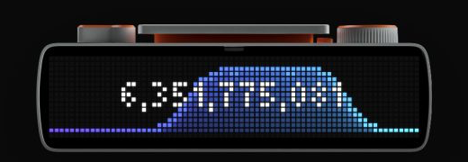
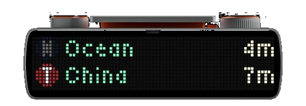

# busyctl

`busyctl` is a single, self-contained Go CLI for custom BUSY Bar apps. It uses the stock HTTP API; no custom firmware is required.

Bundled apps include Apple Music now-playing, a full-screen clock, live Codex token activity, and live Muni arrivals:

```sh
busyctl music
busyctl clock
busyctl tokens
busyctl muni
```

## Install

Download the archive for your machine from [GitHub Releases](https://github.com/matteing/busyctl/releases/latest):

| Operating system | Intel / AMD | ARM |
| --- | --- | --- |
| macOS | `darwin_amd64` | `darwin_arm64` |
| Linux | `linux_amd64` | `linux_arm64` |
| Windows | `windows_amd64.zip` | `windows_arm64.zip` |

Each release contains the binary, README, license, and a SHA-256 checksum manifest. Release binaries are currently unsigned. On macOS, downloading with `curl` and extracting in Terminal avoids most browser quarantine friction; otherwise macOS may ask you to approve the binary in Privacy & Security.

With Go 1.26.5 or newer, you can instead install directly:

```sh
go install github.com/matteing/busyctl/cmd/busyctl@latest
```

## Apple Music

USB uses `10.0.4.20` by default:

```sh
busyctl music
```

<p align="center">
  
</p>

Start directly in visualizer view:

```sh
busyctl music --view visualizer
```

<p align="center">
  
</p>

For Wi-Fi:

```sh
busyctl --host 192.168.1.50 --token 1234 music
```

The process polls `https://matteing.com/api/now-playing` every ten seconds. Use `--source` to override that endpoint. `BUSYBAR_HOST` and `BUSYBAR_TOKEN` provide equivalent environment configuration.

Press Ctrl+C to stop. Use `--keep-display` to retain the final frame. Run `busyctl --help` or `busyctl music --help` for every option.

### Display design

- The composition has a true one-pixel outer margin. The 14×14 album cover uses a lightly rounded, antialiased squircle mask and stays static at the left.
- Titles use the bundled BUSY Bar font. Only one row scrolls at a time: song for six seconds, pause for three, artist for six, pause for three.
- The visualizer is a seamless 15 FPS spectrum built from narrow musical transients, a changing connected energy bed, and a vivid perceptual gradient extracted from the album artwork.
- The waveform fades smoothly into the display at its edges. Each tick updates one fixed image element; the cover is not resent.
- When playback pauses, timers stop and the current view freezes in grayscale. Playback resumes in that same view.

## Clock

The face is based on [Max Swinkels' community clock](https://maxswinkels.github.io/busybar-apps/apps/clock/). By default it shows 12-hour local time with AM/PM and no seconds, while the colon smoothly fades through one cycle each second.

```sh
busyctl clock
```

<p align="center">
  
</p>

Enable seconds or switch back to the original 24-hour layout:

```sh
busyctl clock --seconds
busyctl clock --12-hour=false --seconds
```

Seconds and blinking colons are independently configurable:

```sh
busyctl clock --blink-colon=false
busyctl clock --seconds --blink-colon
```

The clock aligns updates to the next minute, second, or half-second boundary and only redraws when the visible state changes.

## Tokens

```sh
busyctl tokens
```

<p align="center">
  
</p>

The display shows a high-contrast GitHub-style 27-week daily activity grid with the all-time local token total tucked against the right edge in the BUSY Bar's native font. It reads the running user's Codex state database (`~/.codex/state_5.sqlite`) in read-only mode and samples five times per second; it does not read or transmit Codex credentials. Override discovery with `CODEX_STATE_DB` or `--database`, and adjust the refresh interval with `--poll`.

For a focused live view, show the exact all-time total centered over a scrolling 14-second token-rate sparkline. The background uses a filled purple-to-cyan gradient and smooth square-root-scaled activity pulses, while a lightweight total-only query samples every 200 milliseconds:

```sh
busyctl tokens --view count
```

<p align="center">
  
</p>

Token totals are grouped by the day each local Codex task was created, matching the available local task accounting. A task that remains active across midnight stays attributed to its creation day.

## Muni

```sh
busyctl muni
```

<p align="center">
  
</p>

By default, `muni` shows the two legs toward OpenAI: N Judah at Embarcadero & Folsom toward Caltrain, then T Third at 4th & King toward Sunnydale. Switch to the return commute explicitly:

```sh
busyctl muni to-openai
busyctl muni from-openai
```

`busyctl muni openai` is an alias for `from-openai`. `MUNI_LOCATION` provides the same runtime override. Precise runtime coordinates can still select the nearest J, K, L, M, N, or T platform without storing an address in the repository:

```sh
busyctl muni --location LAT,LON
```

Optional auto mode uses the free `ipwho.is` network-location estimate. Because that sends your public IP address to the provider, it requires explicit opt-in and never runs silently:

```sh
busyctl muni auto --allow-network-location
```

The display follows the reference sign style: compact 7×7 route markers share one left column, destinations use soft mint text, and natural-width ETA labels lock to the same hardware-tested right edge. Only the `Now` label pulses, fading smoothly between 55% and 100% brightness while both route badges and destination labels remain steady. Predictions refresh every 15 seconds from the free UmoIQ endpoint used by SFMTA's public stop pages; no signup is required.

## Build from source

Go is pinned with `mise`:

```sh
mise install
mise run check
mise run build
```

The resulting `bin/busyctl` is self-contained.

## Releases

Pushing a semantic version tag such as `v0.2.0` runs the release workflow. It tests the exact tag and publishes CGO-free archives for macOS, Linux, and Windows on both amd64 and arm64.
